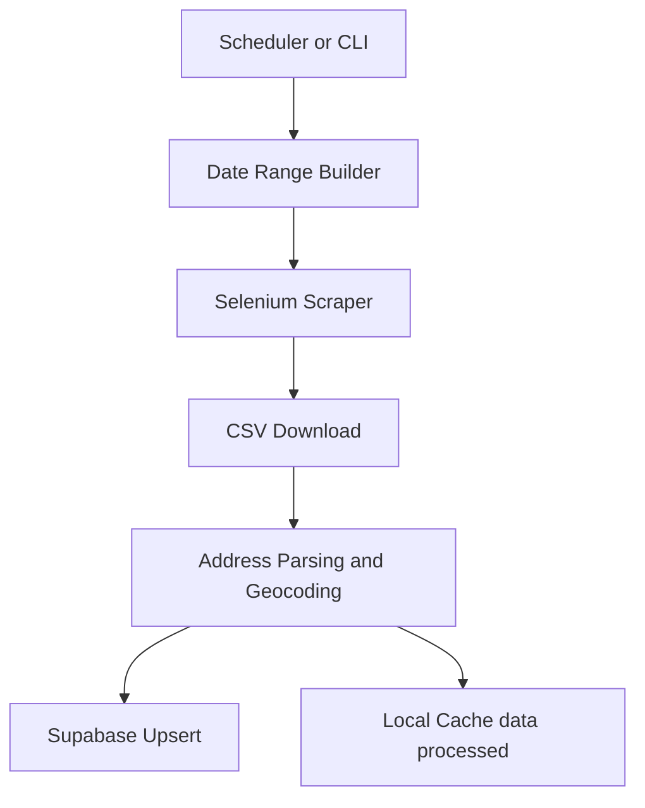

# Architecture

```mermaid
flowchart TD
  A[Scheduler or CLI] --> B[Date Range Builder]
  B --> C[Selenium Scraper]
  C --> D[CSV Download]
  D --> E[Address Parsing and Geocoding]
  E --> F[Supabase Upsert]
  E --> G[Local Cache data processed]
```
